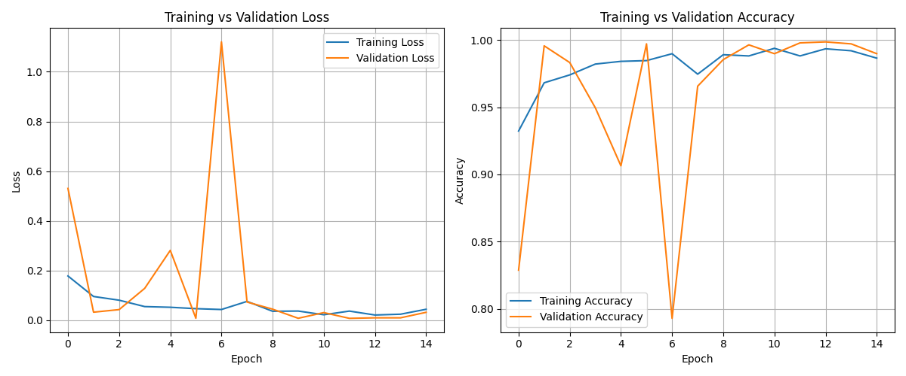

# 🤖 AI-Powered Quality Control System

This project is an automated quality control system that uses a deep learning model to classify products as "good" or "defective" based on images.

---

## 📊 Model Performance

The model was trained for 15 epochs and shows excellent performance in distinguishing between the two classes.

### ### Training History

Here are the training and validation accuracy/loss curves. The model learns quickly and stabilizes, indicating effective training.

* **Training vs Validation Loss**: The loss for both training and validation decreases significantly and converges, showing that the model is not overfitting.
* **Training vs Validation Accuracy**: The model consistently achieves high accuracy (above 95%) on both the training and validation sets.

### ### Confusion Matrix

The confusion matrix on the test set confirms the model's outstanding classification performance.

* **High Precision and Recall**:
    * **778 defective items** were correctly identified as defective.
    * **575 good items** were correctly identified as good.
* **Low Error Rate**:
    * Only **14 defective items** were misclassified as good.
    * There were **zero instances** of a good item being misclassified as defective, which is excellent for quality assurance.

---

## 🚀 Model Optimization: Quantization

To improve efficiency, the model was converted from 32-bit floating point (FP32) to 8-bit integer (INT8) through quantization. This makes the model faster and smaller without a significant drop in performance.

* **Model Size**: Quantization successfully reduced the model size.
* **Inference Latency (CPU)**: The inference speed saw a slight improvement, making the model faster for real-time applications.
